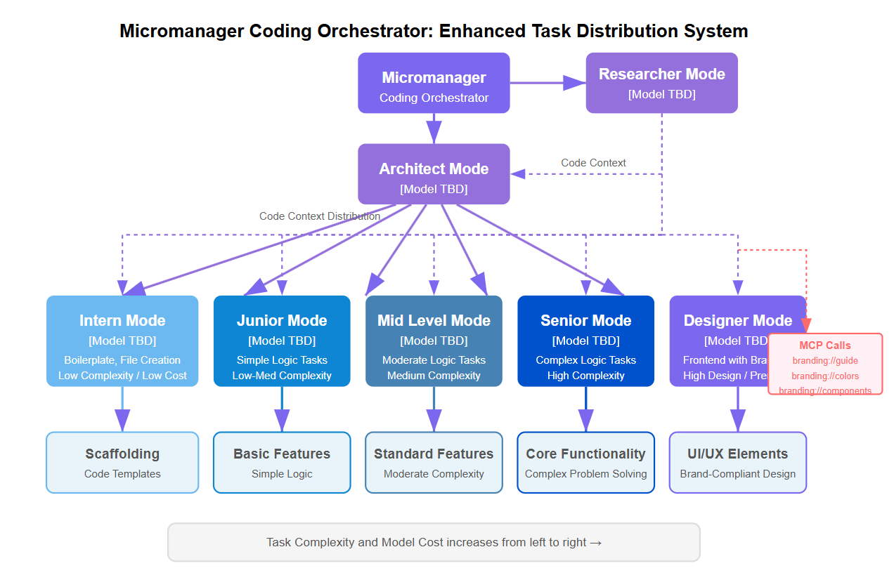

# RooCode MicroManager

## Motivation

In the evolving landscape of AI development, where free access to powerful models is becoming increasingly limited, cost optimization becomes crucial. RooCode MicroManager addresses this challenge through intelligent task orchestration:

- **Cost-Efficient Workflow**: Instead of using the most expensive model for every task, MicroManager intelligently delegates work to appropriately sized models based on task complexity
- **Model Optimization**: Each specialized mode is configured with the most cost-effective model that can handle its specific responsibilities. This can include:
  - Local models for tasks that don't require cloud processing
  - Free models for simpler tasks
  - Paid models only when necessary for complex operations
- **Resource Allocation**: Simple tasks are handled by smaller, more affordable models (like GPT 4.1 nano), while complex tasks are reserved for more capable models (like Gemini 2.5 Pro Preview)
- **Future-Proofing**: As AI services move towards paid models, this approach ensures sustainable development practices by optimizing resource usage

This repository contains a collection of specialized AI modes for code development and project management. To use these modes in your project, copy `custom_modes.json` to your project's root directory and rename it to `.roomodes`.

## Getting Started with MicroManager

The MicroManager mode is the recommended starting point for all tasks. It acts as an intelligent orchestrator that:

1. Breaks down complex tasks into manageable subtasks
2. Delegates work to the most appropriate specialized mode
3. Coordinates between different modes to ensure efficient task completion

### Available Specialized Modes

- **Architect**: For high-level planning and architectural decisions
- **Intern**: For simple, well-defined implementation tasks
- **Junior**: For slightly complex implementation tasks
- **MidLevel**: For broader implementation tasks
- **Senior**: For complex, multi-file implementations
- **Designer**: For UI/UX design and styling
- **Researcher**: For codebase research and analysis

### Workflow Example

1. Start in MicroManager mode with your task
2. MicroManager analyzes the task and creates a plan
3. Tasks are delegated to appropriate modes:
   - Planning → Architect
   - Simple implementation → Intern
   - Complex implementation → Senior
   - UI/UX → Designer
   - Research → Researcher
4. Results are synthesized and presented back to you

## Model Configuration

Each mode is optimized based on the capabilities of various AI models to ensure the best performance:

| Mode | Recommended Model |
|------|------------------|
| MicroManager | Gemini 2.5 Pro Preview | Claude 3.7 Thinking
| Intern | Llama 3.1 Nemotron 253B | GPT 4.1 nano | local model
| Junior | GPT 4.1 mini
| MidLevel | GPT 4.1 | GPT o4-mini | DeepSeek v3
| Senior | Gemini 2.5 Pro Preview or Claude 3.7 |
| Designer | Claude 3.7 |
| Researcher | Gemini 2.0 Flash |

### Special Notes

- **CodeShortRules**: This is a prompt override for Intern mode, particularly useful when working with less capable models. It provides more explicit instructions and constraints to ensure successful task completion. Its recommended in particular for models that are local models with limited context windows.

## Available Modes

### 🤖 MicroManager
The orchestrator mode that coordinates complex tasks by delegating them to appropriate specialized modes. It breaks down complex problems into manageable subtasks and assigns them to the most suitable mode based on complexity and requirements.

### 1️⃣ Intern
A focused implementation mode that follows exact instructions for code implementation. Best for simple, well-defined tasks with specific requirements. If unable to complete a task, it will escalate to Junior or MidLevel mode.

### 2️⃣ Junior
An ambitious implementation mode that aims to write high-quality code while following instructions. Will attempt to fix errors independently but will escalate to MidLevel mode if encountering persistent issues.

### 3️⃣ MidLevel
A balanced implementation mode that can work with general guidance and has some freedom in implementation approaches. Capable of handling most problems but will escalate to Senior mode if encountering complex issues.

### 4️⃣ Senior
An expert implementation mode that can work across multiple files and solve complex problems. Takes a broader view of the codebase to understand the full context of problems before implementing solutions.

### 📘 Researcher
Specialized in providing research information about the existing codebase. Helps identify file locations, code functionality, and potential impacts of changes.

### 🎨 Designer
Focused on UI/UX design and styling. Works with existing branding and creates beautiful user interfaces.

## Usage

1. Copy `custom_modes.json` to your project's root directory
2. Rename it to `.roomodes`
3. The modes will be available for use in your project

Each mode is designed for specific types of tasks and can be used in combination to handle complex development workflows. The MicroManager mode can help coordinate between different modes to accomplish larger tasks efficiently.

Sometimes you have to restart VSCode to get the modes to show in Roo Code.
